# Entity Relationship Diagram

Covers all Prisma models in `prisma/schema.prisma`. Attribute lists are trimmed to
the fields that matter for relationships and business logic; see the schema file
for the full column list (types, defaults, indexes).

```mermaid
erDiagram
  ORGANIZATION ||--o{ DEPARTMENT : has
  ORGANIZATION ||--o{ USER : employs
  ORGANIZATION ||--o{ VEHICLE : owns
  ORGANIZATION ||--o{ FUEL_PRICE : sets
  ORGANIZATION ||--o{ SYSTEM_SETTING : configures

  DEPARTMENT ||--o{ USER : "groups"

  USER ||--o| VEHICLE : "assigned (1:1)"
  USER ||--o{ FUEL_TRANSACTION : records
  USER ||--o{ FUEL_REQUEST : submits
  USER ||--o{ FUEL_REQUEST_APPROVAL : "acts on"
  USER ||--o{ GPS_TRIP : drives
  USER ||--o{ APPROVED_ROUTE : "commutes via"
  USER ||--o{ APPROVED_ROUTE : creates
  USER ||--o{ FUEL_ALLOCATION : "allocation for"
  USER ||--o{ FUEL_ALLOCATION : triggers
  USER ||--o{ STIPEND_HISTORY : "stipend subject"
  USER ||--o{ STIPEND_HISTORY : "changed by"
  USER ||--o{ FUEL_PRICE : "set by"
  USER ||--o{ SYSTEM_SETTING : "changed by"
  USER ||--o{ ALERT : "alert subject"
  USER ||--o{ ALERT : resolves
  USER ||--o{ AUDIT_LOG : performs
  USER ||--o{ NOTIFICATION : receives
  USER ||--o{ NOTIFICATION_LOG : "outbox for"
  USER ||--o{ DEVICE_TOKEN : registers
  USER ||--o{ SESSION : authenticates
  USER ||--o{ OTP_CODE : verifies
  USER ||--o{ LOGIN_HISTORY : "login attempts"

  VEHICLE ||--o{ FUEL_TRANSACTION : fuels
  VEHICLE ||--o{ FUEL_REQUEST : "fuel for"
  VEHICLE ||--o{ GPS_TRIP : tracked
  VEHICLE ||--o{ ALERT : "alert subject"
  VEHICLE ||--o{ APPROVED_ROUTE : "used on"
  VEHICLE ||--o{ FUEL_ALLOCATION : "allocation for"

  FUEL_REQUEST ||--o{ FUEL_REQUEST_APPROVAL : "transition trail"
  FUEL_REQUEST ||--o{ ALERT : "budget alert"

  GPS_TRIP ||--o{ TRIP_WAYPOINT : contains
  GPS_TRIP ||--o{ ALERT : "detour alert"
  GPS_TRIP }o--o| APPROVED_ROUTE : "compared against"

  APPROVED_ROUTE ||--o{ APPROVED_ROUTE_WAYPOINT : contains

  FUEL_TRANSACTION ||--o{ ALERT : "consumption alert"

  ORGANIZATION {
    string id PK
    string name
    string code
    datetime deletedAt
  }

  DEPARTMENT {
    string id PK
    string organizationId FK
    string name
  }

  USER {
    string id PK
    string organizationId FK
    string departmentId FK
    string email
    string role "SUPER_ADMIN | FLEET_MANAGER | FINANCE_OFFICER | DRIVER"
    boolean isApproved
    boolean isActive
    decimal homeLat
    decimal homeLng
    decimal workSiteLat
    decimal workSiteLng
    enum fuelType
    decimal monthlyFuelStipendRwf
    decimal monthlyBudgetRwf
    int workingDaysPerMonth
    datetime deletedAt
  }

  VEHICLE {
    string id PK
    string organizationId FK
    string plateNumber
    enum vehicleType
    enum fuelType
    decimal tankCapacityL
    decimal currentFuelL
    decimal odometerKm
    decimal fuelEfficiencyKmpl
    enum status
    string assignedDriverId FK "unique - 1:1 with User"
    datetime deletedAt
  }

  FUEL_PRICE {
    string id PK
    string organizationId FK
    enum fuelType
    decimal priceRwf
    date effectiveDate
    string setById FK
  }

  SYSTEM_SETTING {
    string id PK
    string organizationId FK "nullable = global default"
    string key
    string value
    string changedById FK
  }

  STIPEND_HISTORY {
    string id PK
    string userId FK
    decimal previousAmount
    decimal newAmount
    string changedById FK
    string reason
    datetime changedAt
  }

  FUEL_ALLOCATION {
    string id PK
    string driverId FK
    string vehicleId FK
    int periodYear
    int periodMonth
    decimal distanceKm
    int workingDays
    decimal vehicleEfficiency
    decimal fuelPriceRwf
    decimal bufferPercent
    decimal baseRequirementL
    decimal bufferL
    decimal finalAllocationL
    decimal extraFuelGrantedL
    decimal totalAvailableL
    decimal projectedCostRwf
    string recomputeReason
    string triggeredById FK
    datetime createdAt "append-only - latest row = current"
  }

  FUEL_TRANSACTION {
    string id PK
    string vehicleId FK
    string driverId FK
    enum transactionType "REFILL | USAGE | ADJUSTMENT"
    decimal quantityL
    decimal unitPriceRwf
    decimal totalCostRwf
    decimal odometerKm
    decimal fuelLevelBeforeL
    decimal fuelLevelAfterL
    datetime recordedAt
  }

  FUEL_REQUEST {
    string id PK
    string vehicleId FK
    string driverId FK
    decimal requestedQuantityL
    decimal expectedDistanceKm
    decimal estimatedFuelRequiredL
    enum status "PENDING | FLEET_MANAGER_APPROVED | FLEET_MANAGER_REJECTED | FINANCE_APPROVED | FINANCE_REJECTED | CANCELLED"
    string finalDecisionById FK
    datetime finalDecisionAt
    string rejectionReason
    decimal grantedQuantityL
  }

  FUEL_REQUEST_APPROVAL {
    string id PK
    string fuelRequestId FK
    string actorId FK
    enum fromStatus
    enum toStatus
    string comment
    datetime actedAt
  }

  GPS_TRIP {
    string id PK
    string vehicleId FK
    string driverId FK
    string approvedRouteId FK
    enum status "PLANNED | IN_PROGRESS | COMPLETED | CANCELLED"
    decimal distanceKm
    decimal fuelConsumedL
    decimal maxDeviationKm
    decimal detourDistanceKm
    boolean isDetourFlagged
    datetime startedAt
    datetime endedAt
    int durationMinutes
  }

  TRIP_WAYPOINT {
    string id PK
    string tripId FK
    int sequenceNo
    decimal latitude
    decimal longitude
    decimal speedKmh
    decimal fuelLevelL
    datetime recordedAt
  }

  APPROVED_ROUTE {
    string id PK
    string driverId FK
    string vehicleId FK
    string name
    decimal totalDistanceKm
    decimal toleranceKm
    boolean isActive
    string createdById FK
    datetime deletedAt
  }

  APPROVED_ROUTE_WAYPOINT {
    string id PK
    string approvedRouteId FK
    int sequenceNo
    decimal latitude
    decimal longitude
    string label
  }

  ALERT {
    string id PK
    string vehicleId FK
    string driverId FK
    string tripId FK
    string transactionId FK
    string fuelRequestId FK
    enum alertType "POSSIBLE_THEFT | LOW_FUEL | RAPID_FUEL_DROP | UNUSUAL_ROUTE | OVER_CONSUMPTION | ROUTE_DETOUR | BUDGET_EXCEEDED | STIPEND_CHANGED"
    enum severity "CRITICAL | HIGH | MEDIUM | LOW"
    enum status "OPEN | ACKNOWLEDGED | RESOLVED | DISMISSED"
    string title
    decimal aiConfidence
    string resolvedById FK
    datetime resolvedAt
  }

  AUDIT_LOG {
    string id PK
    string actorId FK
    enum action
    string entityType
    string entityId
    json metadata
    string ipAddress
  }

  NOTIFICATION {
    string id PK
    string userId FK
    string title
    string message
    string type
    enum category
    enum priority
    string relatedId
    string dedupeKey "unique with userId"
    boolean isRead
    datetime readAt
  }

  DEVICE_TOKEN {
    string id PK
    string userId FK
    string deviceId "unique with userId"
    string token "FCM token, globally unique"
    enum deviceType
    boolean isActive
    datetime deletedAt
  }

  NOTIFICATION_LOG {
    string id PK
    string userId FK
    enum channel "EMAIL | PUSH (IN_APP written directly to NOTIFICATION)"
    string eventType
    json payload
    enum status "PENDING | SENT | FAILED | SKIPPED"
    int attempts
    string lastError
    datetime sentAt
  }

  SESSION {
    string id PK
    string userId FK
    string refreshToken "hashed, unique"
    string deviceId
    datetime expiresAt
    datetime revokedAt
  }

  OTP_CODE {
    string id PK
    string userId FK
    string codeHash
    enum purpose "LOGIN | PASSWORD_RESET | NEW_DEVICE | EMAIL_VERIFICATION"
    enum status "PENDING | VERIFIED | EXPIRED | CONSUMED"
    datetime expiresAt
    int attempts
  }

  LOGIN_HISTORY {
    string id PK
    string userId FK
    boolean success
    string ipAddress
    string deviceId
    string failureReason
  }

  RATE_LIMIT_ENTRY {
    string id PK
    string key "unique"
    int count
    datetime windowStart
    datetime expiresAt
  }
```

